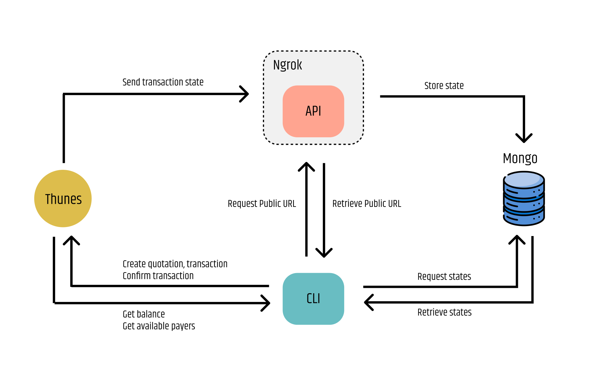

# 1. Decisions

To approach the challenge of sending money through Thunes and receiving transaction states, I've created two main programs: one API solely for listening to states and one CLI for sending money. This avoids creating an API that directly calls the Thunes API, treating it more as a service than an end app.

The code was organized following the default Go pattern using internal and cmd folders. Inside cmd, you will find the entry points for both the API and CLI, while internal contains the core logic. A config folder loads the configuration file with secrets into the program using the Viper library. There are two main configurations: one for each program (API and CLI). The API doesn't need access to the Thunes API, so it doesn't require its secrets.

The API implementation is simple, without a complex structure like having a service/controller. However, I decided to implement a repository pattern for transactions. This decision benefits both the API, which needs to store transaction states, and the CLI, which needs to read them. To enable the API to receive callbacks from Thunes, I used Ngrok to expose the local port to the web since we're not pushing the code to a cloud environment. Ngrok requires a free account to work.

The CLI was developed using the Bubbletea framework, which made it verbose due to the nature of triggering and managing states within the framework. The result is an interactive UI that allows navigation through screens.

I didn't have time to create extensive tests; I only created one for the API and one for Thunes client, which demonstrates how I would approach testing the rest of the code. Dependencies are injected into every piece of code, making it easier to test by mocking interfaces.

# 2. Diagram

The following image illustrates the architecture of this solution and how the services interact with each other.



# 3. Setup

### Requirements:
- Docker
- Docker Compose
- Ngrok free account (API TOKEN)

### 3.1. Setup secrets

Run the following command to create configuration files for the services:

```bash
$ cp api-example.yaml api.yaml && cp cli-example.yaml cli.yaml
```
After running the command above, open the created files and fill them with your secret keys.

You also need to export your Ngrok API token, which you can obtain from the Ngrok admin page:
```bash
$ export NGROK_AUTHTOKEN=<your_token_here>
```

### 3.2. Build

Use Docker Compose to build a Docker container for all services:

```bash
make build
```
### 3.3. Start
Execute the following command to start the previously created containers:
```bash
make start
```

### 3.4. Test
Run the following command to execute all tests. Note that the project is not fully covered:
```
make tests
```


# 4. Difficulties

The first problem I encountered was creating a quotation. I attempted to send a currency that wasn't in my account, and the API error returned was misleading, stating that the payer wasn't activated in my account instead of indicating the currency issue. It took considerable time to understand the error, but eventually, fetching my balance data clarified that I should send the currency available in my wallet.

The second problem arose from my choice of using the Bubbletea framework for the CLI. I regret this decision because the framework works in a cumbersome manner, making it challenging to maintain readable code while managing multiple states on the same screen. Extensive research was required, and I had to devise my own solution to support multiple screens, as this feature isn't documented in the framework and lacks discussion in forums, which simplified code maintenance.


# 5. Feedback on Thunes

### 5.1. Documentation

I found it a bit difficult to navigate through the Thunes documentation. It resembles the documentation style of the Scrapy library, which isn't very effective for explaining an API.

Finding the required endpoints was challenging, and excessive scrolling was required due to empty spaces.

The examples provided were helpful, but including a "try it" section or a command to copy for cURL would enhance usability.

### 5.2. API

The payment process with Thunes involved several steps (getting payer ID, creating quotation, creating transaction, confirming transaction), which could be streamlined by integrating quotation into the transaction creation process since it still requires confirmation.

During development, I encountered inconsistencies. For instance, when creating a transaction, the returned object includes status and status_class as strings. However, when receiving callbacks, these fields are returned as numbers. Additionally, there's no validation to ensure that the external_id in the transaction matches the one in the quotation, which seems inconsistent.

Thunes could benefit from having an endpoint to retrieve all transaction states without needing to rely solely on callbacks. Although such an endpoint exists, it only returns the last state, which complicates solution architecture and increases complexity.

# 6. Ideas to improve

- Add tests for all modules
- Use a library to automatically mock interfaces so it gets easier to write tests
- Encrypt transaction state before saving into MongoDB
- Define a pattern on all the screens so it gets easier to write components and let the UI code more readable.
- Add checks to the UI so it does not break in case the user send inputs before loading
- Let the user customize more the transaction payload (e.g names and documents)
